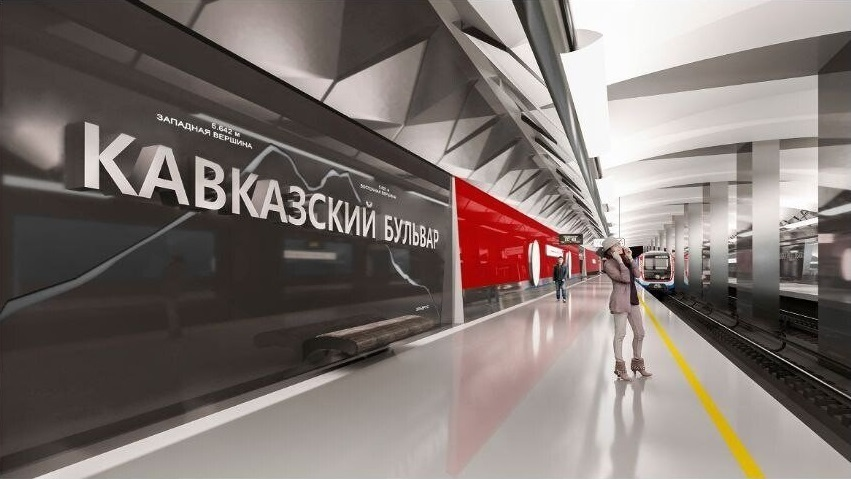

# «Луганская» Бирюлёвской линии: стена в грунте, оборотные тупики и технология мелкого заложения

## Как под Кавказским бульваром собирают станцию, которую пассажир увидит только после всех бетонных и монтажных работ

На поверхности строительство выглядит буднично: забор, временные проходы, тяжёлая техника, машины с арматурой, бентонитовый узел и информационные щиты. Самой станции ещё нет — есть только строительная площадка, которая уже меняет привычное движение района и даёт представление о масштабе будущего объекта.

Будущая станция **«Луганская»** Бирюлёвской линии строится в Царицыне, вдоль Кавказского бульвара, вблизи примыкания Ереванской улицы. На раннем проектном изображении она ещё подписана прежним названием — **«Кавказский бульвар»**: тёмная путевая стена, крупная типографика, линия горного профиля, красный акцент вдоль платформы, гранёный потолок.

Рендер показывает архитектурную идею, но не раскрывает конструктивные решения.

Для «Техники — молодёжи» главный вопрос другой: как такую станцию встраивают в живой городской район, почему выбран метод **«стена в грунте»**, зачем перед станцией нужны **оборотные тупики** и что на стройке означает фраза «станция мелкого заложения».



*Фото 1. Рендер проектного решения на этапе названия «Кавказский бульвар». Видны береговая платформа, тёмная путевая стена с графическим профилем Кавказского хребта и красная линия навигационного акцента. После переименования станция проходит как «Луганская»; финальная отделка с новым названием в открытых материалах отдельно не раскрыта.*

---

## Паспорт объекта

**Станция:** «Луганская».  
**Линия:** Бирюлёвская, 18-я линия Московского метрополитена на схеме.  
**Цвет линии:** рубиновый.  
**Прежнее проектное название:** «Кавказский бульвар».  
**Район:** Царицыно, Южный административный округ Москвы.  
**Расположение:** вдоль Кавказского бульвара, вблизи примыкания к Ереванской улице.  
**Участок:** «Курьяново» — «Бирюлёво».  
**Тип станции:** мелкого заложения, колонная, с береговыми платформами.  
**Плановый срок второго участка:** 2029 год.  
**Основная ранняя технология:** ограждение котлована методом «стена в грунте».  
**Параметры стены для станционного комплекса:** толщина не менее 1 м, длина более 524 м.  
**Площадь котлована станционного комплекса:** почти 8 тыс. кв. м.  
**Монолитный железобетон для стены:** более 20 тыс. куб. м.  
**Крепление котлована:** распорная система массой свыше 13,2 тыс. т.  
**Оборотные тупики перед станцией:** 330 м, открытый способ строительства.  
**Котлован оборотных тупиков:** более 7,7 тыс. кв. м.  
**Объём выемки грунта по тупикам:** около 221 тыс. куб. м.  
**Техника на площадке:** более 100 основных машин, механизмов и единиц оборудования.

---

## Бирюлёвская линия: новый южный радиус

Бирюлёвская линия — не короткая вставка между существующими линиями, а полноценный южный радиус длиной более 22 км. На ней запланированы десять станций: «ЗИЛ», «Остров Мечты», «Кленовый бульвар», «Курьяново», «Москворечье», «Луганская», «Каспийская», «Липецкая», «Лебедянская», «Бирюлёво».

Линию будут вводить поэтапно. Первый участок «ЗИЛ» — «Курьяново» длиной 8,65 км с четырьмя станциями планируют завершить в 2028 году. Второй участок «Курьяново» — «Бирюлёво» длиной 13,55 км с шестью станциями — в 2029-м.

Смысл этой ветки понятен без транспортной поэзии. Южным районам нужна ещё одна сильная линия, а не только подвоз к уже загруженным станциям. Бирюлёвская ветка должна обслужить Даниловский район, Нагатинский Затон, Печатники, Царицыно, Бирюлёво Восточное и Бирюлёво Западное. Пересадки предусмотрены на МЦК, Троицкую, Замоскворецкую и Большую кольцевую линии.

Для «Луганской» это задаёт роль. Она не главная станция линии, не конечная и не крупный пересадочный узел. Но она попадает в точку, где району нужен новый вход в метро, а не очередная пересадка через наземный транспорт.

---

## Название: коротко и по делу

Станция начиналась в материалах как **«Кавказский бульвар»** — по месту строительства. В 2025 году в городских сообщениях закрепилось новое название — **«Луганская»**.

Эта смена важна для навигации, документации, будущих схем и оформления путевых стен. Конструктив станции от названия не меняется: объект остаётся на том же участке Бирюлёвской линии, с тем же типом заложения и той же городской задачей.

---

## Мелкое заложение: удобно пассажиру, трудно строителю

Пассажир любит станции мелкого заложения. Спуск короче, путь до платформы быстрее, ориентация проще. Не надо долго ехать на эскалаторе и мысленно считать, сколько ещё до поверхности.

Строитель смотрит иначе.

Мелкое заложение в плотном районе означает большой котлован почти под существующей городской тканью. Над ним — улицы, транспорт, сети, пешеходные маршруты, зелень. Рядом — дома и рабочая жизнь района. Под ним — грунты, вода, будущая железобетонная коробка станции, тоннели и технологические камеры.

Здесь нельзя начать с «выкопаем яму, а дальше разберёмся». Сначала создают силовой контур, который удержит грунт и воду. Потом раскрывают котлован, ставят распорки, ведут мониторинг. Только после этого появляется место для постоянных конструкций станции.

Для мелкого заложения это рабочая последовательность: ограждение, контроль, разработка грунта, постоянный железобетон. Нарушить порядок — значит получить не ускорение, а аварийный риск.

---

## «Стена в грунте»: как делают силовой контур станции

Для «Луганской» применяют метод **«стена в грунте»** — одну из базовых технологий подземного строительства в плотной городской застройке.

Процесс начинается с разработки узкой глубокой траншеи по периметру будущего котлована с помощью грейферов и гидрофрез. Чтобы стенки траншеи не обрушились, её сразу заполняют бентонитовым раствором. Он создаёт гидростатическое противодавление и работает как временная жидкая опалубка.

Далее в траншею опускают арматурный каркас. Бетон подают по трубе снизу вверх — методом ВПТ, вертикально перемещаемой трубы. Бетонная смесь вытесняет бентонитовый раствор, который откачивают для повторного использования. После твердения бетона в грунте формируется монолитная железобетонная стена толщиной не менее одного метра.

На бумаге процесс выглядит простым. На практике это десятки критически важных операций: контроль плотности и качества бентонитового раствора, вертикальность панели, непрерывность бетонирования, очистка траншеи от осадка. Ошибка на любом этапе может привести к деформациям, дополнительным затратам или остановке работ.

Для станционного комплекса «Луганской» запроектирована стена длиной более 524 м с расходом свыше 20 тыс. куб. м монолитного железобетона. Котлован занимает почти 8 тыс. кв. м. После устройства стены монтируют распорную систему массой более 13,2 тыс. т.

---

## Схема 1. Метод «стена в грунте»: рабочая логика

```text
Стадия 1. Разработка траншеи
──────────────────────────────────────── поверхность
        │  грейфер / гидрофреза
        ▼
     ┌─────────┐
     │         │  траншея заполнена бентонитовым раствором
     │         │  раствор удерживает стенки от осыпания
     │         │
─────┴─────────┴──────────────────────── грунт


Стадия 2. Арматурный каркас
──────────────────────────────────────── поверхность
        │
        ▼
     ║═════════║
     ║═════════║  каркас опускают в траншею
     ║═════════║
─────╨═════════╨──────────────────────── грунт


Стадия 3. Бетонирование снизу вверх
──────────────────────────────────────── поверхность
        │ труба подачи бетона
        ▼
     █████████
     █████████  бетон вытесняет раствор
     █████████  и формирует железобетонную панель
─────█████████────────────────────────── грунт


Стадия 4. Раскрытие котлована
──────────────────────────────────────── поверхность
███│← распорки, подкосы, расстрелы →│███
███│                                │███
███│        выемка грунта            │███
███│                                │███
███┴────────────────────────────────┴███
```

Эта схема не заменяет инженерный чертёж. Её задача проще: показать последовательность. Сначала силовой контур. Потом грунт. Не наоборот.

---

## Распорная система: 13,2 тысячи тонн временной инженерии

Когда внутри контура начинают выбирать грунт, стены котлована получают боковое давление. Грунт не любит пустоту. Вода — тем более.

Поэтому «стена в грунте» работает не одна. Ей нужна распорная система: металлические трубы, подкосы, расстрелы, ярусы крепления. Они удерживают стенки, пока строители идут вниз и собирают постоянную железобетонную коробку станции.

На «Луганской» масса такой системы превысит 13,2 тыс. т. Для сравнения в быту подобрать трудно; лучше не играть в сомнительные аналогии. Достаточно представить, что речь идёт о тысячах тонн металлоконструкций, которые почти никто из будущих пассажиров не увидит.

Но именно они позволяют строить станцию без недопустимых деформаций котлована и поверхности.

В таких работах геодезия — не формальность. Марки на зданиях, реперы, тахеометры, контрольные измерения, журнал деформаций — это нервная система стройки. Если стена ушла не туда или грунт начал «дышать» сильнее расчёта, строитель должен узнать об этом сразу, а не после того, как треснул асфальт или повело сеть.

---

## Схема 2. Упрощённый поперечный разрез станции

```text
                    городская поверхность
────────────────────────────────────────────────────

             верхняя плита коробки станции
════════════════════════════════════════════════════

███ стена в грунте ███             ███ стена в грунте ███
███                ███             ███                ███
███ платформа      ███ путь 1 путь 2 ███      платформа ███
███ береговая      ███ ───── ───── ███      береговая  ███
███                ███             ███                ███

════════════════════════════════════════════════════
             нижняя плита / основание коробки
```

Станция с береговыми платформами устроена иначе, чем станция с островной платформой. Пассажирские зоны расположены по сторонам путей. Значит, по-другому решаются выходы, эвакуация, навигация, размещение служебных помещений и инженерных систем.

Для пассажира отличие простое: надо сразу правильно выбрать сторону по направлению движения. Для проектировщика — это уже планировочная задача, которую нельзя исправить парой указателей в последний день.

---

## Колонная схема: колонны не декор, а расчёт

«Луганская» заявлена как колонная станция мелкого заложения. В таком объекте колонны держат не настроение архитектора, а верхнее перекрытие.

Колонны принимают нагрузку от плиты, передают её на основание, задают ритм зала и позволяют не делать перекрытие чрезмерно тяжёлым. Потом придут отделочники, появятся панели, свет, навигация. Но сначала колонна — это часть силовой схемы.

На проектном изображении хорошо читается вытянутое пространство береговой платформы: ряд колонн, путевая стена, линия безопасности у края, поезд в перспективе. Это не дворцовое метро середины XX века. Это рабочая станция нового московского типа: крупная навигация, чистые поверхности, световая дисциплина, минимум лишнего орнамента.

Горный профиль на путевой стене был логичен при названии «Кавказский бульвар». После перехода к названию «Луганская» финальное графическое решение в открытых материалах не показано.

---

## Оборотные тупики: скрытая эксплуатационная инфраструктура

Перед станцией «Луганская» построят оборотные тупики протяжённостью 330 м открытым способом. Площадь котлована для них превысит 7,7 тыс. кв. м, а объём выемки грунта составит около 221 тыс. куб. м.

Для пассажира эти тупики останутся невидимыми. Для работы линии они имеют принципиальное значение. Оборотные тупики позволяют поездам менять направление движения без выхода на следующий перегон, организовывать укороченные маршруты, ночной отстой составов, резерв и оперативное восстановление графика при сбоях. В них также возможно проведение части технического обслуживания подвижного состава.

Особенно важны оборотные устройства на этапе поэтапного ввода линии. Пока весь радиус ещё не работает в полном объёме, они дают возможность гибко формировать эксплуатационную схему и не ждать завершения всех участков.

---

## Схема 3. Зачем нужны оборотные тупики

```text
                 направление к центру
─────────────────────── путь 1 ──────────────────────
                        │
                        │ стрелочный перевод
                        ▼
                 ═══════════════
                 ═ тупиковые   ═  330 м
                 ═ пути        ═  оборот / отстой / резерв
                 ═══════════════
                        ▲
                        │ стрелочный перевод
─────────────────────── путь 2 ──────────────────────
                 направление от центра
```

В реальном проекте геометрия путей сложнее. Смысл схемы — показать эксплуатационную функцию: линия получает место, где состав можно развернуть, убрать из графика, поставить на отстой или использовать как резерв.

---

## ПИК: что известно, а что не надо додумывать

В исходном сообщении говорится, что группа компаний **ПИК** примет участие в строительстве станции и ищет подрядчика для возведения ограждающих конструкций котлована. Профильные сообщения и тендерная карточка ПИК указывают на тему «Метро Луганская» и приём заявок в конце июня 2026 года.

Здесь требуется осторожность.

По открытым материалам можно уверенно говорить об участии в контуре работ, связанных с ограждающими конструкциями котлована. Нельзя без документов писать, что ПИК «строит всю станцию» в полном инженерном смысле. Нельзя называть модель концессией или ГЧП, если такие условия не опубликованы.

Но сам факт показателен. В Москве транспортная инфраструктура всё теснее связана с развитием территории. Жильё, улицы, инженерные сети и метро приходится собирать в один городской узел. Девелоперская логика здесь встречается с тяжёлым метростроением — не в презентации, а в бетоне, грунте и подрядных процедурах.

---

## Геология, вода и сети: почему котлован не терпит легкомыслия

Царицыно — не пустая площадка за городом. Это сложившийся район с транспортом, подземными коммуникациями, зеленью, домами и привычными пешеходными маршрутами.

В таких условиях метод «стена в грунте» выбирают не ради модного названия. Он позволяет создать жёсткий контур котлована до основной выемки грунта. Стена защищает котлован от грунта и воды, снижает риск осадок поверхности, помогает сохранить инженерные сети и сооружения рядом со стройкой.

Вода на таких объектах — отдельный противник. Поверхностную воду на площадке планируют собирать по периметру специальными лотками, направлять в аккумулирующие ёмкости и предварительно очищать. Также заявлены замкнутые системы водоснабжения и водонепроницаемые отстойники.

Эту технологическую часть редко показывают на визуализациях. Но она отличает организованную площадку от грязной раны в городе.

После завершения работ территорию рядом со станцией должны благоустроить. Детальная схема будущих подходов, остановок и озеленения в открытых материалах пока не раскрыта, поэтому рисовать её словами преждевременно.

---

## Тоннели: «Луганская» должна попасть в общий ритм линии

Станция не существует отдельно от перегонов.

На Бирюлёвской линии уже идёт тоннельная работа. В июне 2025 года стартовала проходка первого, правого перегонного тоннеля длиной 1,67 км и диаметром 6 м между «Островом Мечты» и «Кленовым бульваром». В марте 2026 года город сообщил о завершении правого тоннеля на этом участке. В июне 2026 года началась проходка левого тоннеля между «ЗИЛом» и «Островом Мечты»; по этому перегону щиту предстоит пройти почти 1,5 км.

У линии есть ещё одна техническая особенность: почти половина тоннелей будет двухпутной. На участке между «Кленовым бульваром» и «Курьяново» для ускорения работ применяют сочетание однопутных и двухпутного тоннелей; там задействован ТПМК «Ольга» с гидропригрузом.

Для «Луганской» это означает простую вещь. Её коробка, тупики, тоннели, вентиляция, электроснабжение, автоматика и связь должны сойтись в единую систему. Отдельно построенная станция ничего не решает. Метро начинает работать только тогда, когда все эти части собраны и проверены вместе.

---

## Соседние станции и язык нового метро

«Луганскую» корректнее сравнивать не с дворцовыми станциями старого московского метро, а с соседними объектами новой линии.

У «Кленового бульвара» утверждена архитектурная концепция с арками и алюминиевыми кленовыми листьями на путевых стенах. «ЗИЛ» получает другой образ: нержавеющая шлифованная сталь, тёмный термообработанный гранит, мозаичное панно, привязка к промышленной истории территории.

У «Луганской» раннее изображение опиралось на прежнее название: тёмная стена, крупная надпись, горный профиль. После переименования художественный мотив может измениться. Общая тенденция линии уже читается: новые станции проектируют как ясные транспортные интерьеры, где отделка подчинена навигации, свету и конструктивному ритму.

---

## Что изменится для района

Официальные материалы связывают запуск Бирюлёвской линии с улучшением транспортного обслуживания южных районов Москвы. Для «Луганской» это означает прежде всего новый сценарий поездки для части Царицына.

Сейчас многие маршруты района завязаны на подвоз к действующим станциям, в том числе к Замоскворецкой линии. Новая станция не отменит старые маршруты и не сделает соседние платформы пустыми. Так метро не работает.

Она сделает другое: перераспределит поток. Часть пассажиров пойдёт к новой линии, часть изменит пересадку, часть сократит наземный участок. В транспортной системе это серьёзнее, чем кажется. Один новый вход в метро иногда меняет не только карту поездок, но и привычки района.

---

## Строительный порядок: что должно произойти до пассажиров

Упрощённая последовательность работ выглядит так:

1. Подготовка площадки, временное движение, вынос или защита инженерных сетей.
2. Устройство форшахт и технологической зоны для разработки траншей.
3. Разработка траншей грейферами и фрезами под защитой бентонитового раствора.
4. Опускание арматурных каркасов и бетонирование панелей стены в грунте.
5. Контроль качества стены, геодезический и маркшейдерский мониторинг.
6. Поэтапная выемка грунта внутри контура.
7. Монтаж распорной системы, подкосов и расстрелов.
8. Строительство постоянной железобетонной коробки станции.
9. Устройство оборотных тупиков и сопряжение с тоннелями.
10. Монтаж инженерных систем: вентиляция, электроснабжение, связь, автоматика, безопасность.
11. Архитектурная отделка, навигация, испытания, пусконаладка.
12. Передача станции в пассажирскую эксплуатацию.

Каждый пункт скучен только на вид. Пропустить нельзя ни один.

---

## Что пока остаётся неизвестным

По «Луганской» уже известны основные строительные параметры раннего этапа: стена в грунте, площадь котлована, масса распорной системы, параметры оборотных тупиков, способ их строительства.

Но открытые материалы пока не дают полной картины по нескольким вещам.

Нет опубликованного финального архитектурного решения станции после переименования. Не раскрыта точная ведомость отделочных материалов. Не опубликован полный инженерно-геологический разрез площадки. Нет детальной схемы благоустройства поверхности у выходов.

Это не недостаток проекта. Это нормальная ситуация для строящегося объекта. Для статьи важно другое: не заполнять эти пустоты фантазией.

---

## Технический финал

«Луганская» интересна не сменой названия и не ранним рендером, а технологией строительства.

Сначала под городом формируют железобетонный контур толщиной не менее метра. Затем внутри него выбирают грунт, стены фиксируют распорками и расстрелами, а геодезисты и маркшейдеры ведут постоянный мониторинг деформаций. Параллельно по линии идут тоннели, технологические камеры и инженерные системы.

Когда пассажир впервые спустится на платформу, главная инженерная работа уже будет скрыта внутри конструкции. Именно так работает современное подземное строительство: сначала десятки тысяч кубометров бетона, тысячи тонн металла, точный расчёт и жёсткий контроль — а в итоге обычный, надёжный элемент городской транспортной системы.

---

## Источники

1. [Комплекс градостроительной политики и строительства города Москвы. «Бирюлёвская линия метро»](https://stroi.mos.ru/metro/metro-biriulievskaia-liniia-mietro)
2. [Комплекс градостроительной политики и строительства города Москвы. «Станция метро “Луганская” — Бирюлёвская линия»](https://stroi.mos.ru/metro/station/114)
3. [Комплекс градостроительной политики и строительства города Москвы. «Сергей Собянин: стартовало строительство станции метро “Луганская”»](https://stroi.mos.ru/news/sierghiei-sobianin-startovalo-stroitiel-stvo-stantsii-mietro-lughanskaia)
4. [Комплекс градостроительной политики и строительства города Москвы. «Владимир Ефимов: технологию “стена в грунте” применяют при строительстве станции метро “Луганская”»](https://stroi.mos.ru/news/vladimir-iefimov-tiekhnologhiiu-stiena-v-ghruntie-primieniaiut-pri-stroitiel-stvie-stantsii-mietro-lughanskaia)
5. [Комплекс градостроительной политики и строительства города Москвы. «Владимир Ефимов: станция метро “Луганская” будет оборудована оборотными тупиками»](https://stroi.mos.ru/news/vladimir-iefimov-stantsiia-mietro-lughanskaia-budiet-oborudovana-oborotnymi-tupikami)
6. [Москва 24. «Оборотные тупики длиной 330 метров построят перед станцией метро “Луганская”»](https://www.m24.ru/news/transport/21032026/884591)
7. [Комплекс градостроительной политики и строительства города Москвы. «На Бирюлёвской линии метро проложен правый тоннель от “Острова Мечты” до “Кленового бульвара”»](https://stroi.mos.ru/news/sierghiei-sobianin-ghotov-pravyi-tonniel-biriulievskoi-linii-mietro-ot-ostrova-miechty-do-klienovogho-bul-vara)
8. [Комплекс градостроительной политики и строительства города Москвы. «Сергей Собянин: началась проходка левого тоннеля между станциями метро “ЗИЛ” и “Остров Мечты”»](https://stroi.mos.ru/news/nachalas-prokhodka-lievogho-tonnielia-miezhdu-stantsiiami-mietro-zil-i-ostrov-miechty-mer)
9. [Комплекс градостроительной политики и строительства города Москвы. «Владимир Ефимов: на участке между станциями “Кленовый бульвар” и “Курьяново” построят двухпутный и однопутные тоннели»](https://stroi.mos.ru/news/vladimir-iefimov-na-uchastkie-miezhdu-stantsiiami-klienovyi-bul-var-i-kur-ianovo-postroiat-dvukhputnyi-i-odnoputnyie-tonnieli)
10. [Комплекс градостроительной политики и строительства города Москвы. «Собянин: утверждена архитектурная концепция станции метро “Кленовый бульвар” Бирюлёвской линии»](https://stroi.mos.ru/news/sobianin-utvierzhdiena-arkhitiekturnaia-kontsieptsiia-stantsii-mietro-klienovyi-bul-var-biriuliovskoi-linii)
11. [Комплекс градостроительной политики и строительства города Москвы. «Станция метро “ЗИЛ” — Бирюлёвская линия»](https://stroi.mos.ru/metro/station/109)
12. [ПАО «ПИК СЗ». Тендерная карточка «Метро Луганская.zip»](https://tender.pik.ru/tenders/08dcbb49-6fc2-11f1-bf9f-0050568d1f75)
